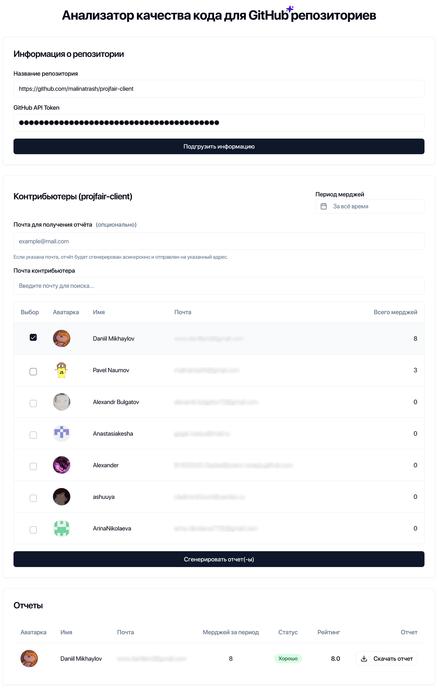

# Code Quality Reporter

<div align="center">
  
  <h3>Анализатор качества кода для GitHub репозиториев</h3>
</div>

## О проекте

**Code Quality Reporter** — это комплексное приложение, включающее в себя:

- **Серверную часть** (Python, FastAPI) — анализирует репозитории, генерирует отчёты, отправляет email-уведомления, предоставляет API и систему скачивания файлов.
- **Клиентскую часть** (React, TypeScript) — предоставляет удобный веб-интерфейс для работы с анализатором, визуализации результатов и управления анализом.

Обе части могут работать независимо, но вместе обеспечивают полный функционал для анализа и визуализации качества кода GitHub-репозиториев.

<div align="center">
  
</div>

## Описание проекта

Code Quality Reporter состоит из двух частей:

- **Сервер (FastAPI, Python):** автоматический анализ вкладов контрибьютеров, генерация PDF-отчётов, система скачивания, email-уведомления, API для клиента.
- **Клиент (React, TypeScript):** современный интерфейс для взаимодействия с сервером, выбора репозиториев и контрибьютеров, просмотра и скачивания отчётов.

## Основные возможности

- Анализ репозиториев и вкладов контрибьютеров с GitHub
- Генерация подробных PDF-отчётов по каждому участнику
- Система скачивания индивидуальных и групповых отчётов
- Email-уведомления с ссылками на скачивание
- Корректная обработка имён файлов для Windows
- Использование переменной окружения `APP_BASE_URL` для формирования ссылок
- Возможность интеграции с клиентским приложением (см. папку `client/`, если требуется)

## Технологии

- **Python 3.9+**, **FastAPI** — серверная часть и REST API
- **PDF генерация** — формирование отчётов по результатам анализа
- **SMTP** — отправка email-уведомлений
- **GitHub API** — получение данных о репозиториях и контрибьюторах
- **Pydantic**, **SQLAlchemy** (если используется база данных)
- **Клиент (опционально)**: React, TypeScript (см. папку `client/`)

## Установка и запуск

### Предварительные требования

- Python 3.9 или выше (для сервера)
- pip
- Node.js 14+ и npm (для клиента)
- Персональный GitHub токен (для повышения лимитов GitHub API)

### Шаги установки

1. **Клонируйте репозиторий**

```bash
git clone https://github.com/yourusername/code-quality-reporter.git
cd code-quality-reporter
```

#### Установка и запуск сервера

```bash
cd server
pip install -r requirements.txt
```

Создайте файл `.env` в папке `server/` (см. пример ниже).

### Настройка почтовой рассылки

Для отправки email-уведомлений о готовности отчётов необходимо настроить SMTP-параметры в файле `.env`:

```
SMTP_HOST=smtp.example.com
SMTP_PORT=465
SMTP_PASSWORD=your_email_password
EMAIL_SENDER=your_email@example.com
```

**Описание параметров:**

- `SMTP_HOST` — адрес SMTP-сервера вашей почты (например, smtp.gmail.com, smtp.yandex.ru, smtp.mail.ru)
- `SMTP_PORT` — порт SMTP-сервера (обычно 465 для SSL или 587 для TLS)
- `SMTP_PASSWORD` — пароль приложения или основной пароль (см. ниже)
- `EMAIL_SENDER` — email, с которого будут отправляться письма

#### Примеры для популярных сервисов:

**Gmail:**

- SMTP_HOST=smtp.gmail.com
- SMTP_PORT=587
- SMTP_PASSWORD=пароль приложения (создаётся в настройках Google-аккаунта)
- EMAIL_SENDER=your@gmail.com

> Для Gmail требуется создать отдельный "пароль приложения" (https://myaccount.google.com/apppasswords), если двухфакторная аутентификация включена. Обычный пароль не подойдёт.

**Yandex:**

- SMTP_HOST=smtp.yandex.ru
- SMTP_PORT=465
- SMTP_PASSWORD=пароль приложения или основной пароль
- EMAIL_SENDER=your@yandex.ru

**Mail.ru:**

- SMTP_HOST=smtp.mail.ru
- SMTP_PORT=465
- SMTP_PASSWORD=пароль приложения или основной пароль
- EMAIL_SENDER=your@mail.ru

> Для большинства сервисов рекомендуется использовать пароль приложения для безопасности.

После настройки SMTP-параметров сохраните файл `.env`.

---

Теперь можно запускать сервер:

```bash
uvicorn main:app --reload
```

Сервер будет доступен по адресу [http://localhost:8000](http://localhost:8000).

#### Установка и запуск клиента

```bash
cd ../client
npm install --legacy-peer-deps
npm start
```

Клиент будет доступен по адресу [http://localhost:3000](http://localhost:3000) и будет взаимодействовать с сервером через API.

## Использование

1. **Введите URL GitHub репозитория** в поле ввода (например, `https://github.com/facebook/react`)
2. **Выберите контрибьютеров** для анализа из списка
3. **Укажите период времени** для анализа с помощью календаря
4. **Нажмите кнопку "Сгенерировать отчет"** для запуска анализа
5. **Просмотрите результаты** анализа качества кода
6. **Скачайте отчет** в формате PDF

## Получение GitHub токена

Для работы с GitHub API рекомендуется использовать персональный токен:

1. Войдите в свой аккаунт GitHub
2. Перейдите в Settings → Developer settings → Personal access tokens → Fine-grained tokens
3. Нажмите "Generate new token"
4. Выберите разрешения: минимум `public_repo`, `read:user`
5. Скопируйте токен и добавьте его в файл `.env` в папке `server/`

## Архитектура приложения

**Клиентская часть (React + TypeScript)**

- **Структура**:

```
client/
├── src/
│   ├── components/    # UI-компоненты (модальные окна, таблицы, графики)
│   ├── pages/         # Страницы приложения (анализ репозитория, история отчетов)
│   ├── services/      # API-клиенты для взаимодействия с бэкендом
│   ├── hooks/         # Кастомные хуки для управления состоянием
│   └── styles/        # Глобальные стили и темизация
```

- **Технологии**: React 18, TypeScript, Axios

**Серверная часть (FastAPI + Python)**

- **Структура**:

```
server/
├── api/
│   └── routes.py       # Маршруты FastAPI
├── services/
│   ├── github_service.py # Интеграция с GitHub API
│   └── report_generator.py # Генерация PDF отчетов
├── utils/
│   └── file_utils.py   # Утилиты работы с файлами
└── main.py              # Точка входа приложения
```

- **Технологии**: FastAPI, Pydantic, aiohttp

**Взаимодействие компонентов**:

1. Клиент отправляет данные репозитория через REST API
2. Сервер анализирует код через GitHub API
3. Генератор отчетов создает Markdown с метриками качества
4. Email-сервис рассылает результаты
